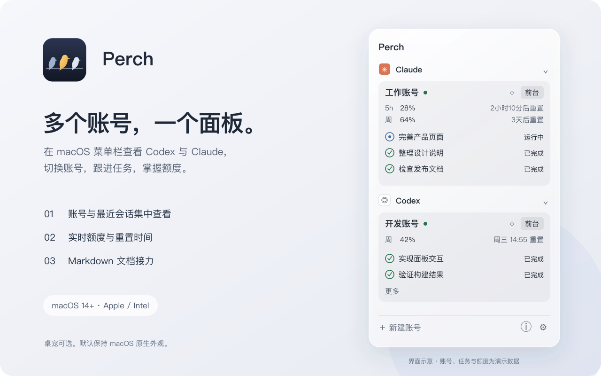

# Perch

**在 macOS 菜单栏或 Windows 系统托盘里，管理多个 Codex / Claude 桌面客户端账号：一眼看到任务和额度，额度用完时把任务接力到另一个账号。**

[下载](#下载与安装) · [快速上手](#快速上手) · [更新记录](CHANGELOG.md) · [从源码构建](#从源码构建)

| 平台 | 最新版本 | 系统要求 |
| --- | --- | --- |
| macOS | [1.1.0](https://github.com/0mn1si2i5/perch/releases/tag/macos-v1.1.0) | macOS 14 及以上，Apple Silicon / Intel |
| Windows | [0.2.0 预览版](https://github.com/0mn1si2i5/perch/releases/tag/windows-v0.2.0) | Windows 10（19041）及以上，x64 |

<p align="center">
  
</p>

上图为 macOS 界面示意，数据均为演示数据。Windows 版使用原生面板，跟随系统浅色／深色，也可选 Pox 主题。

## 能做什么

| 多账号集中管理 | 任务与会话 | 额度与重置时间 |
| --- | --- | --- |
| 按 Codex / Claude 分组，一键启动或调出对应账号的客户端，每个账号的登录和数据互不干扰。 | 查看正在运行的任务和最近的会话；分组、账号和会话都能拖动排序。 | 显示 5 小时和每周额度的已用比例与重置时间，可手动刷新或定期同步；查不到时显示上次的数据并注明时间。 |

**桌宠（可选）**：默认关闭。在设置里开启后，可以选一个静态的原生浮球，或者内置角色 Pox（带配套面板主题）。单击桌宠打开面板，拖动可换位置。

## 换账号，继续同一个任务


1. 右键一个已停下的会话，选择“接力到…”和目标账号。
2. Perch 复制一段提示词并调出原来的客户端；在原对话里粘贴发送，AI 会把交接文档写到指定位置。
3. 文档写好后，回到面板点“继续接力”，Perch 复制文档内容并调出目标客户端。
4. 在目标账号里新建对话，粘贴发送，任务就接着做下去。

也可以直接用已有的 Markdown 文档接力。未完成的接力在重启后还在；面板会保留最近的接力记录。**Perch 不会替你发送任何消息。**

## 下载与安装

两个平台的安装包目前都没有经过系统签名认证，第一次打开时系统会拦一下，按下面的步骤放行即可。只在确认是从本仓库 Releases 页面下载时才这样做。

### macOS

1. 从 [Releases](https://github.com/0mn1si2i5/perch/releases) 下载 `Perch-<版本>-universal.dmg`，打开后把 Perch 拖进“应用程序”。
2. 第一次打开如果提示“无法验证开发者”：打开“系统设置 → 隐私与安全性”，在页面下方找到 Perch，点“仍要打开”。
3. Perch 出现在菜单栏，没有 Dock 图标。

升级：用新版本覆盖旧的 Perch 即可，账号和设置都会保留。

### Windows

1. 从 [Releases](https://github.com/0mn1si2i5/perch/releases) 下载 `Perch-Windows-<版本>-x64.zip`，解压到一个固定的位置，例如 `D:\Apps\Perch`。**整个文件夹都要保留**，不能只拿出 `Perch.exe`。
2. 双击 `Perch.exe`。如果出现蓝色的 SmartScreen 提示，点“更多信息”→“仍要运行”。
3. Perch 出现在系统托盘（右下角，可能被收在 `^` 里），也可以按 `Ctrl+Alt+P` 打开面板。

不需要另装 .NET。升级时关掉 Perch，用新版本的文件夹替换旧的即可。

### 卸载

退出 Perch，删除应用（macOS 删除 Perch.app；Windows 删除解压的文件夹）。如果也不想保留 Perch 的设置和接力文档，再删除下表里“Perch 设置与接力文档”那一行的目录。Codex / Claude 客户端自己的数据不受影响。

## 快速上手

1. 打开 Perch：macOS 点菜单栏图标；Windows 点托盘图标或按 `Ctrl+Alt+P`。
2. 点“新建账号”，选择 Codex 或 Claude，Perch 会启动一个独立的客户端，在里面登录即可。已经在用的客户端会被自动发现。
3. 在面板里查看任务和额度；账号旁的刷新按钮可以立刻同步额度。
4. 想要桌面入口，就在设置里开启桌宠。

点面板外面或按 Esc 收起面板，Perch 会继续在后台运行；要退出，在设置或右键菜单里选“退出”。底栏的 ⓘ 里有简短的用法说明。

<details>
<summary>已知限制</summary>

- **打开会话**：只运行一个 Codex 时，点会话能直接跳到那个对话；同时开着多个 Codex 账号时，只会调出对应账号的窗口，需要你自己点开对话，以免跳错账号。Claude 目前只能调出客户端窗口。
- **Claude 会话**：每个 Claude 账号显示自己客户端里的会话。macOS 上默认的 Claude 账号还会列出本机 Claude Code（命令行）的历史，标记为 `Code`；它不一定和这个桌面账号是同一个登录。Windows 版暂不显示命令行历史。
- **额度**：需要客户端处于登录状态，并依赖官方服务；查询失败时显示上次的数据和查询时间（不是重置时间），悬停可看原因。用 API Key 或第三方服务登录的账号没有订阅额度，会显示“不限”，这不代表对方服务没有限制。
- **排序**：会话顺序只保存在 Perch 里，不改动客户端的会话记录。
- **桌宠的媒体感知**（macOS）：只读取“是否在播放、是什么类型”，不读取歌名等内容。
- 同时登录两个个人账号、完整的跨账号接力等场景仍在实测中，详见 [macOS 验收](docs/macos/acceptance.md)、[Windows 验收](docs/windows/acceptance.md) 和 [功能对齐表](shared/parity.md)。

</details>

## 数据与隐私

| 内容 | macOS | Windows |
| --- | --- | --- |
| Perch 设置与接力文档 | `~/Library/Application Support/Perch/` | `%LOCALAPPDATA%\Perch\` |
| 在 Perch 里新建的客户端数据 | 上述目录下的 `Profiles/` | `%USERPROFILE%\.perch\profiles\` |

- 已有的客户端数据原地使用，Perch 不会移动或删除；从旧版 agent-desk 导入账号也不会删除它的数据。
- 平时只读取会话的标题、状态和工作目录，不读取聊天内容。接力只处理你指定的那份 Markdown 文档。
- 查询额度时，Perch 会读取对应账号在客户端里的登录授权，只在内存中用于向官方服务查询额度，不保存到文件或日志，也不会改变客户端的登录状态。
- Perch 不会自动发送任何聊天消息，不上传你的数据，没有跨设备同步。
- 接力文档等数据目录只有当前用户可以访问。

## 从源码构建

### macOS

需要 Xcode 的 Swift 工具链。

```bash
swift test --package-path macos
./macos/script/build_and_run.sh --build     # 生成 macos/dist.noindex/Perch.app
./macos/script/build_and_run.sh --install   # 安装到 ~/Applications/Perch.app 并启动
./macos/script/package-release.sh          # 生成 DMG、ZIP 和 SHA256SUMS
```

### Windows

需要 .NET 10 SDK。

```powershell
./windows/script/build.ps1 -Action Test
./windows/script/build.ps1 -Action Run
./windows/script/build.ps1 -Action Publish  # dist.noindex/windows/Perch/Perch.exe
./windows/script/build.ps1 -Action Package  # dist.noindex/windows/releases/ 下生成 ZIP 与 SHA256SUMS
```

发布流程见 [macOS 发布说明](docs/macos/releasing.md) 和 [Windows 发布说明](docs/windows/releasing.md)。

### 仓库结构

```text
macos/    SwiftPM、AppKit / SwiftUI、测试与打包脚本
windows/  .NET、WPF 应用、测试与打包脚本
shared/   两端共用的素材、文案、测试样本与设计约定
docs/     架构、验收与发布说明
```

详见 [架构说明](docs/architecture.md)。

## 许可证

代码以 [MIT 许可证](LICENSE) 发布。Pox 角色及其美术素材保留版权，可随 Perch 原样分发；`macos/Vendor/` 下的第三方代码遵循各自的许可证；Codex、ChatGPT、Claude 的名称和图标归各自所有者。详见 [LICENSE](LICENSE) 和 [NOTICE](NOTICE)。
